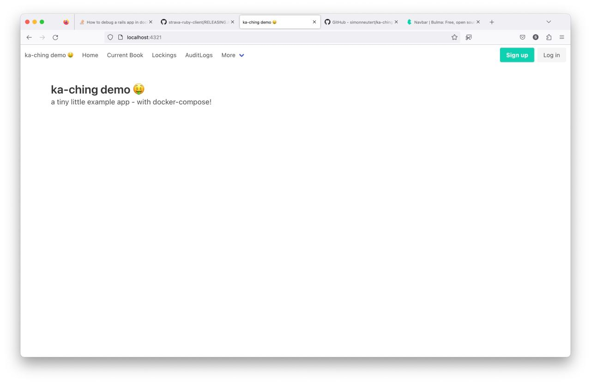
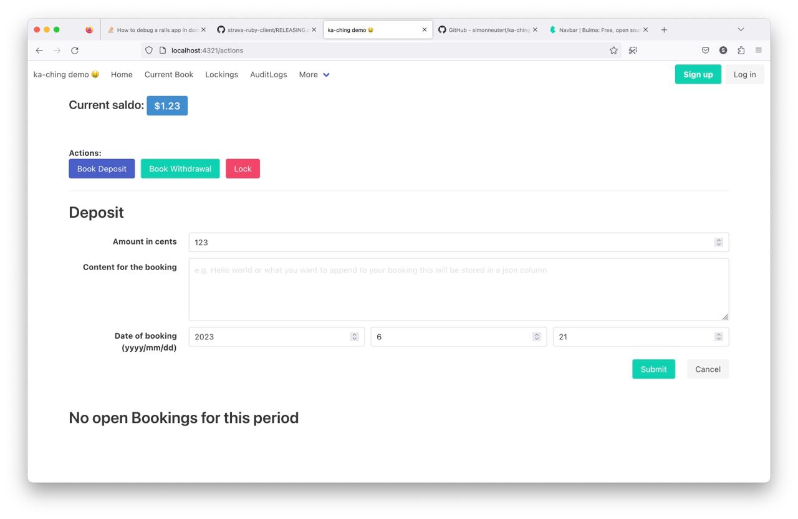
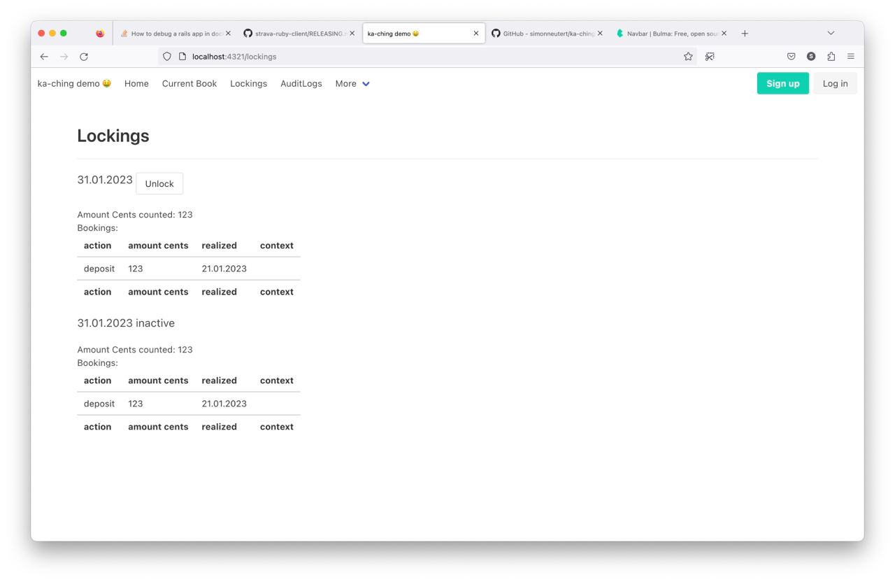
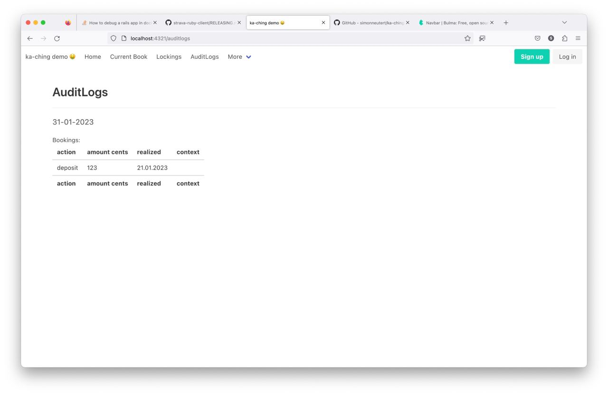

# ka-ching Demo repository<!-- omit in toc -->

This repository has the purpose to demonstrate what can be easily achieved with the [ka-ching-backend](https://github.com/simonneutert/ka-ching-backend) and [ka-ching-client](https://github.com/simonneutert/ka-ching-client) repositories.

---

- [Screenshots](#screenshots)
- [Features](#features)
- [Todos](#todos)
- [Local development environment (with Docker)](#local-development-environment-with-docker)

## Screenshots

  
Click to expand

> ☝️ The landing page of the demo application.

---

> ☝️ The `/actions` page of the demo application, where your current (non locked) cash register bookings are displayed. This is where you deposit, withdraw and lock your cash register.

---

> ☝️ The `/lockings` page of the demo application, where you can see all the locks that are currently active. You can also unlock them from here.

---

> ☝️ The `/audit_logs` page of the demo application, where you can see all the audit logs that have been created. You can also filter them by tenant and by action type.

## Features

- [x] Deposit money into the cash register
- [x] Withdraw money from the cash register
- [x] Show the current balance of the cash register
- [x] Lock the cash register
- [x] Unlock last lock of the cash register 🎉
- [x] Show AuditLogs of current year

## Todos

- [ ] Prohibit double clicks!!!
- [ ] Provide a way to navigate through the AuditLogs
- [ ] Detail view of a single AuditLog
- [ ] Detail view of a single Lock
- [ ] Detail view of a single Booking
- [ ] Show notifications/toasts on errors

  
Roadmap / Planned

### Not yet coded features in demo, but the backend/client provides them (planned)<!-- omit in toc -->

- [ ] pagination through Lockings
- [ ] Show AuditLogs of a year of choice
- [ ] multi-tenant support
  - [ ] change the tenant
  - [ ] create a new tenant
  - [ ] reset a tenant
- [ ] multi-currency support
- [ ] Reset everything every 30min

### Bonus (I may or may not code it for this demo)<!-- omit in toc -->

- [ ] csv export of Lockings
- [ ] csv export of AuditLogs

## Local development environment (with Docker)

1. Clone/Download this repository
2. Run `docker-compose pull` in the root directory of this repository
3. Run `docker-compose up --build` in the root directory of this repository
4. `ka-ching-backend` is now running on `localhost:4567`
5. Want to use `binding.pry`? Then: `docker attach ka-ching-demo-frontend-1` in another terminal window 😎

### IMPORTANT If it is your first time running the application<!-- omit in toc -->

**You will need to initialize the database.**  
To do so, run `docker-compose run --rm backend bin/setup` in another terminal window.  
This will create the database and populate it with some sample data.
THEN stop your containers `ctrl + c` to fire everything up, for good `docker-compose up`.
