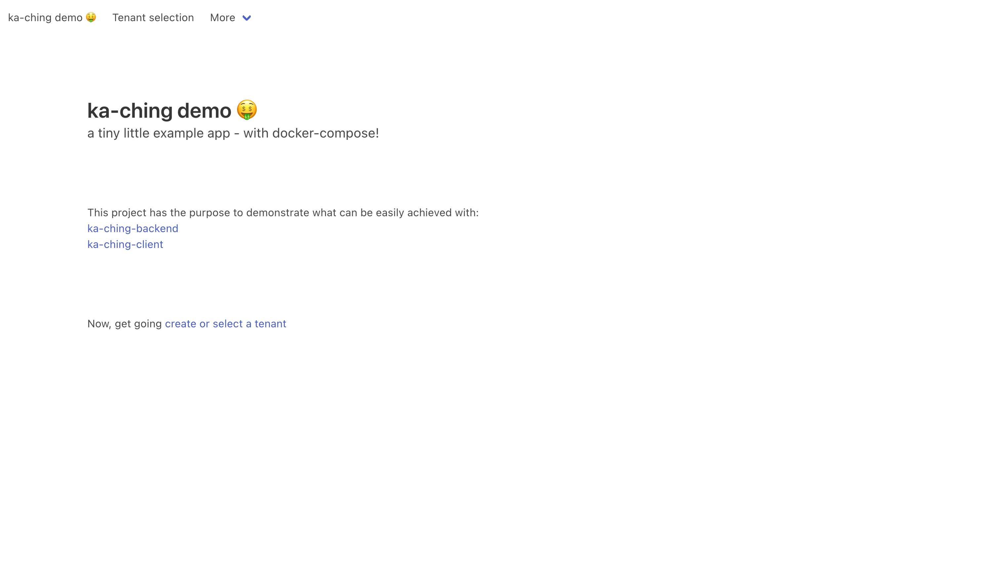
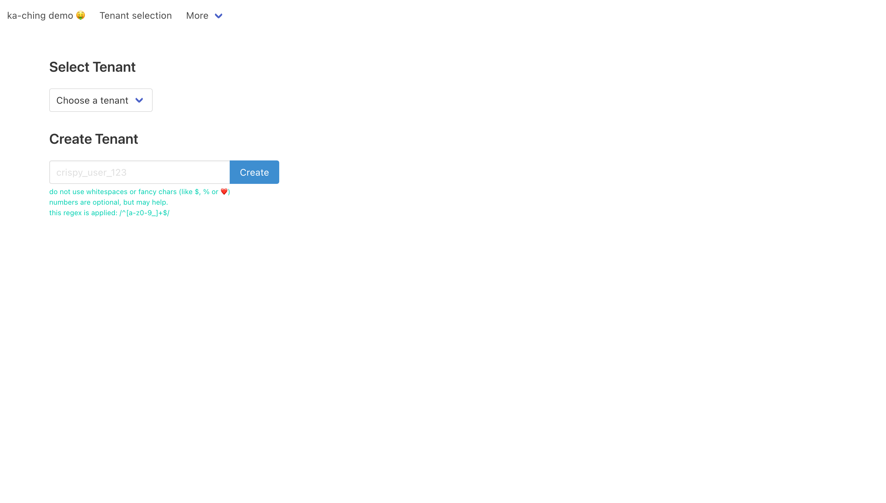
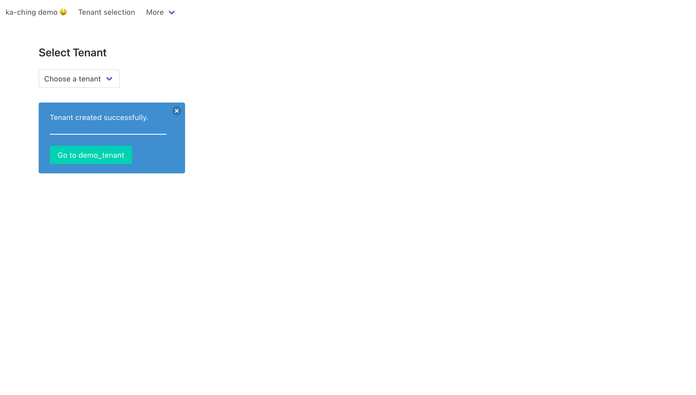
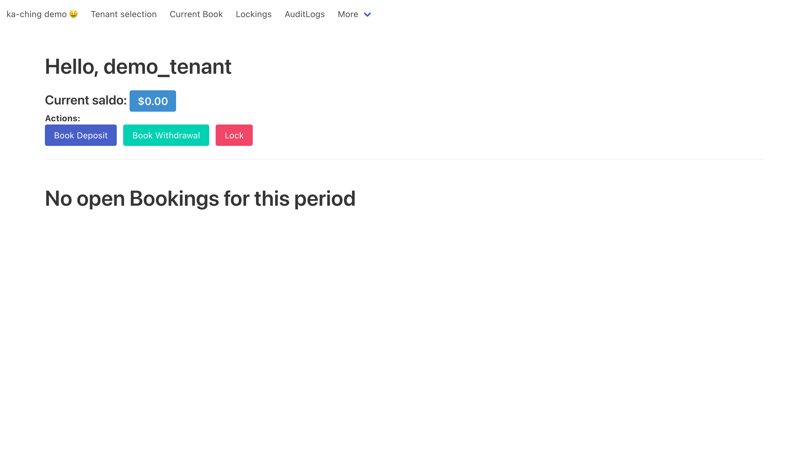
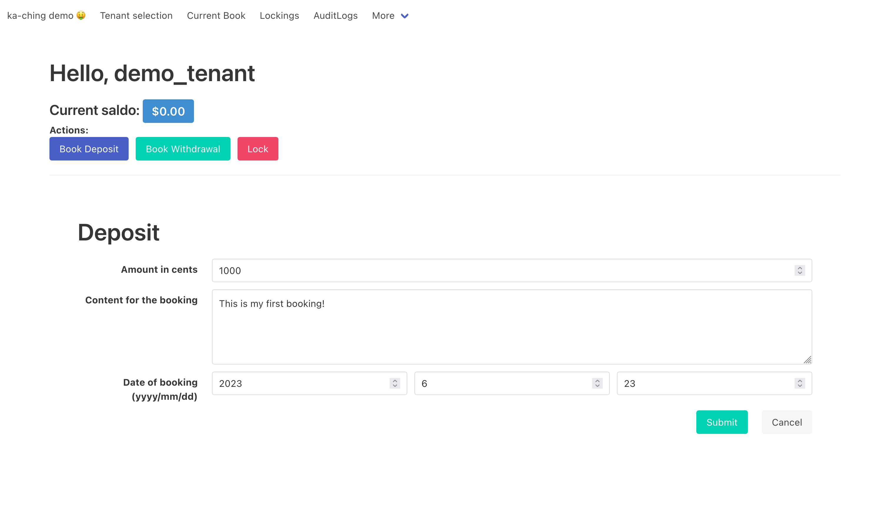
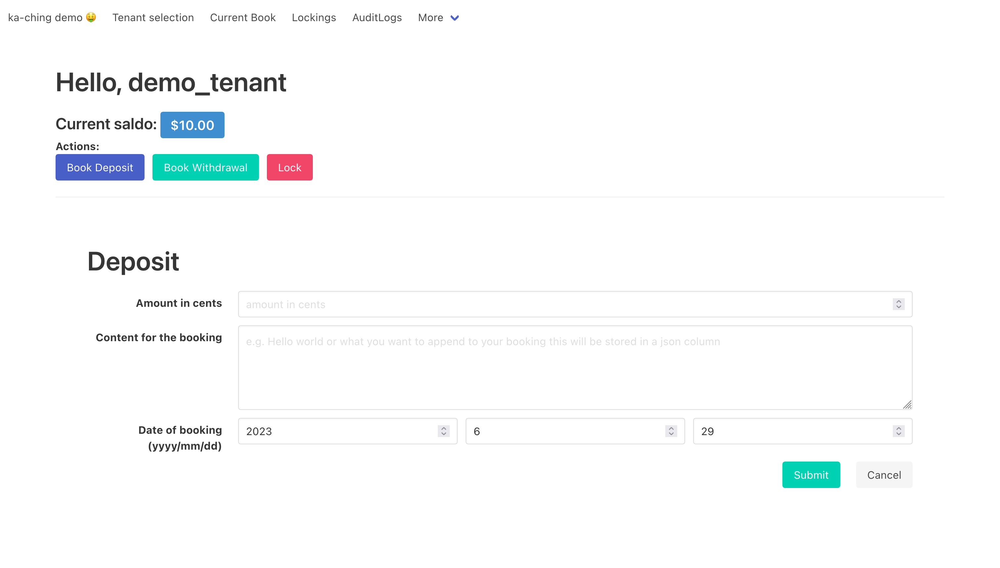
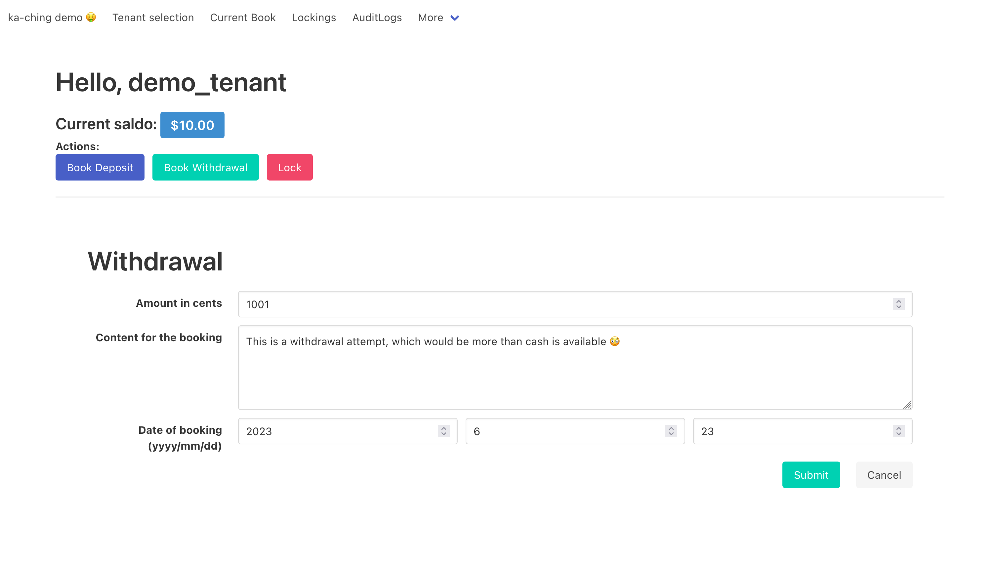
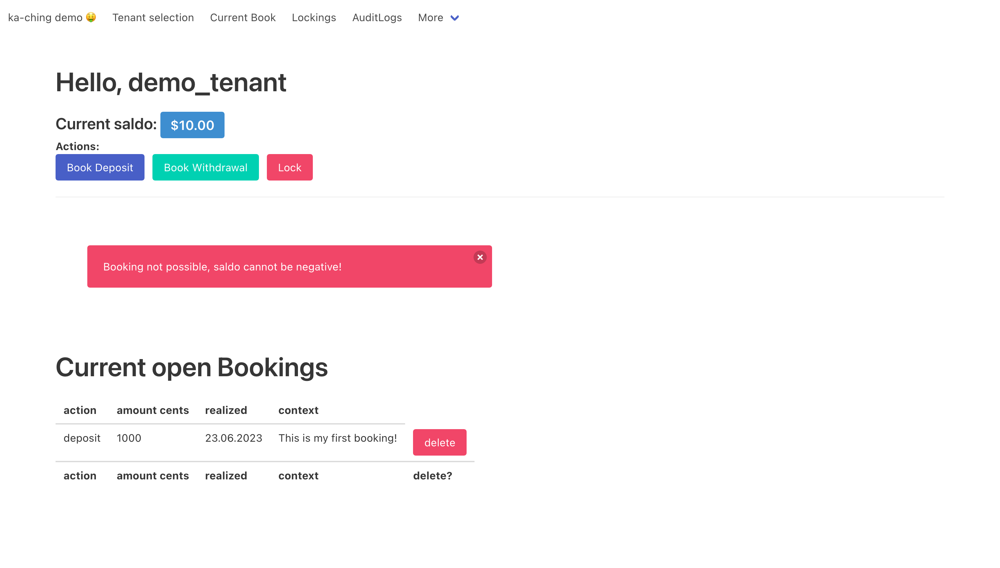

# ka-ching Demo repository<!-- omit in toc -->

This project has the purpose to demonstrate what can be easily achieved with:

- [ka-ching-backend](https://github.com/simonneutert/ka-ching-backend)
- [ka-ching-client](https://github.com/simonneutert/ka-ching-client)

---

- [Screenshots](#screenshots)
- [Features](#features)
- [Todos](#todos)
- [Local development environment (with Docker)](#local-development-environment-with-docker)
  - [Reset the database](#reset-the-database)

## Screenshots

  
Click to expand

> ☝️ The landing page of the demo application.

---

> ☝️ The `/tenants` page of the demo application, where you can select or create a tenant.

---

> ☝️ A tenant has been created and the user is notified about it.

---

> ☝️ The `/bookings` page of the demo application, where you can deposit, withdraw and lock the cash register. Below you will see the current active bookings, be it a deposit or a withdrawal.

---

> ☝️ The `/bookings` page of the demo application with the deposit form selected.

---

> ☝️ You can see the saldo has changed after the deposit has been submitted.

---

> ☝️ Here an attempt to withdraw more money than is available in the cash register is about to be made.

---

> ☝️ Notifying the user that the withdrawal is not possible. Below you can see the current active bookings, be it a deposit or a withdrawal. Current unlocked bookings can be deleted.

## Features

- [x] Deposit money into the cash register
- [x] Withdraw money from the cash register
- [x] Show the current balance of the cash register
- [x] Lock the cash register
- [x] Unlock last lock of the cash register 🎉
- [x] Show AuditLogs of current year
- [x] Prohibit double clicks / double submission (htmx throttle ftw)
- [x] Show notifications/toasts on errors
  - [x] withdraw
  - [x] deposit
- [x] Delete a Booking in the current activeregister
- [ ] Show notifications/toasts on errors
  - [ ] locking
  - [ ] deletion of a booking

## Todos

For features the API backend and client bring, but aren't showcased in this demo, yet.

- [ ] Provide a way to navigate through the AuditLogs
- [ ] Detail view of a single AuditLog
- [ ] Detail view of a single Lock
- [ ] Detail view of a single Booking

  
Roadmap / Planned

### Not yet coded features in demo, but the backend/client provides them (planned)<!-- omit in toc -->

- [ ] pagination through Lockings
- [ ] Show AuditLogs of a year of choice
- [ ] multi-tenant support
  - [ ] change the tenant
  - [ ] create a new tenant
  - [ ] reset a tenant
- [ ] multi-currency support
- [ ] Reset everything every 30min

### Bonus (I may or may not code it for this demo)<!-- omit in toc -->

- [ ] csv export of Lockings
- [ ] csv export of AuditLogs

## Local development environment (with Docker)

1. Clone/Download this repository
2. Run `docker-compose pull` in the root directory of this repository
3. Run `docker-compose up --build` in the root directory of this repository
4. `ka-ching-backend` is now running on `localhost:4567`
5. Want to use `binding.pry`? Then: `docker attach ka-ching-demo-frontend-1` in another terminal window 😎

Check out the **/bin** folder 😉

### Reset the database

Stop your containers `ctrl + c` and run `docker-compose down` in the root directory of this repository.  
Then run `docker-compose up --build` again. And follow the steps below once more 😉

### IMPORTANT If it is your first time running the application<!-- omit in toc -->

**You will need to initialize the database.**  
To do so, run `docker-compose run --rm backend bin/setup` in another terminal window.  
This will create the database and populate it with some sample data.
THEN stop your containers `ctrl + c` to fire everything up, for good `docker-compose up`.
